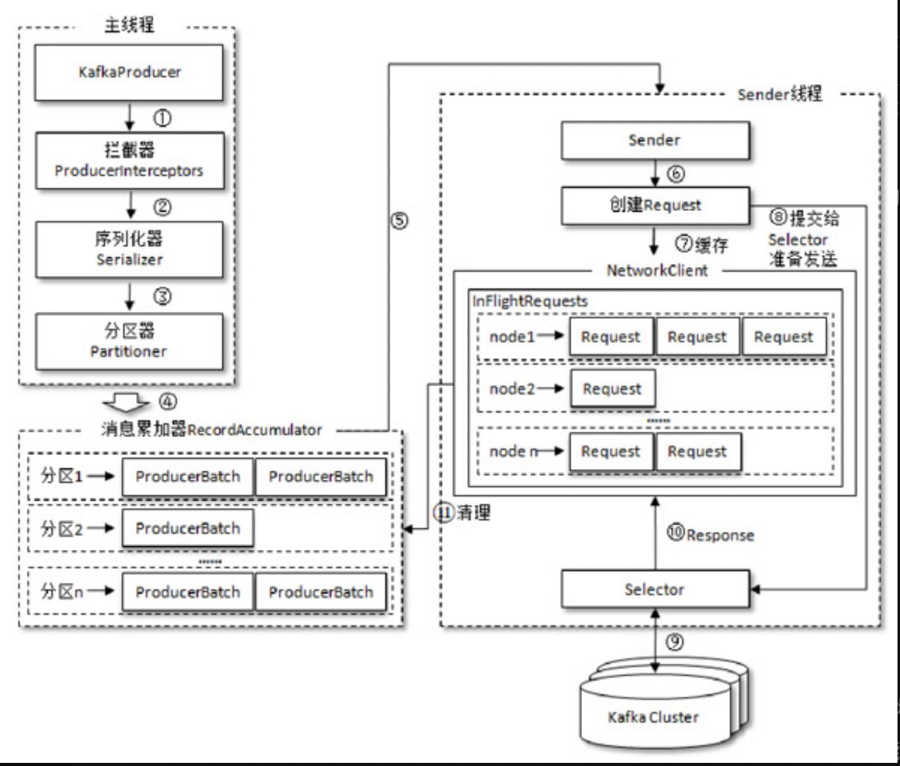
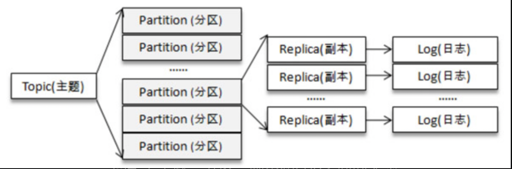

# 常见消息队列
1. Kafka
2. RocketMQ
3. RabbitMQ
# 设计理念
# 通用问题

0. 消息可靠性
1. 重复消费
2. 幂等
3. 有序
4. 消息回溯
5. 消息堆积
6. 数据双写(数据库+队列)
7. 消息持久化
8. 分区分配
9. 为什么Kafka不支持读写分离
10. 如何解决消息队列的延时以及过期失效问题 
11. 消息队列满了以后该怎么处理

### kafka
#### 设计理念
1. 持久化
2. 线程模型
3. 
#### 场景
跨系统解耦、异步任务
1. event system「策略模式、handler」 跨系统用户数据同步、异步任务：数据报表跟新、通知子系统
削峰
#### 概念
### producer 生产者 线程安全
整体架构

#### consumer 消费者 非线程安全，默认自动提交offset

#### topic\\group
主题、分区、组是逻辑概念；一个主题至少有一个分区，一个组内一个消费者消费主题一条消息
kafka只支持增加分区，不支持减少分区
主题、分区、副本、segment log

#### 日志存储

#### ZooKeeper
#### 事务消息
#### 常见问题
1. 重复消息
consumer
- 自定义offset
- 在均衡，分区从一个消费者切换到另外的消费者
  如何避免消息重复：
记录消息id,自定义消息过滤器，查db;多实例部署时使用同一个groupId

2. 消息可靠性
producer、consumer、broker 都有可能丢消息。
- producer： 
什么情况下会丢消息：选择发后既忘模式，不可重试的异常(如消息过大)，且没处理异常。
如果避免丢消息：设置重试次数(可以避免可重试的异常情况的丢失消息)并做好callback的异常处理，ack:all,-1

ack-1, isr队列过半数

- consumer：
  什么情况下会丢消息：手动offset时程序崩溃，kafka默认自动提交offset，消费慢引起消息堆积，broker清理空间消息丢失
  如何避免消息丢失：

- topic
 设置可以从非isr集合选举leader副本，默认false,如果选择true则可能丢消息
5 消息堆积
生产者速度产生速度大于发送到服务器的速度、
- 调大消息累加器的recordAccumulator,缓存空间默认32mb
- 自定义生产者拦截器过滤一部分消息
- 消费者指定offset消费（seek）
- 消费者多线程消费，创建多个实例
- 消费者业务逻辑处理速度优化
- 开始配置文件自动副本在均衡，自动负载均衡（副本优选）时可能造成阻塞；可以利用kafka脚本再少两人使用时手动执行