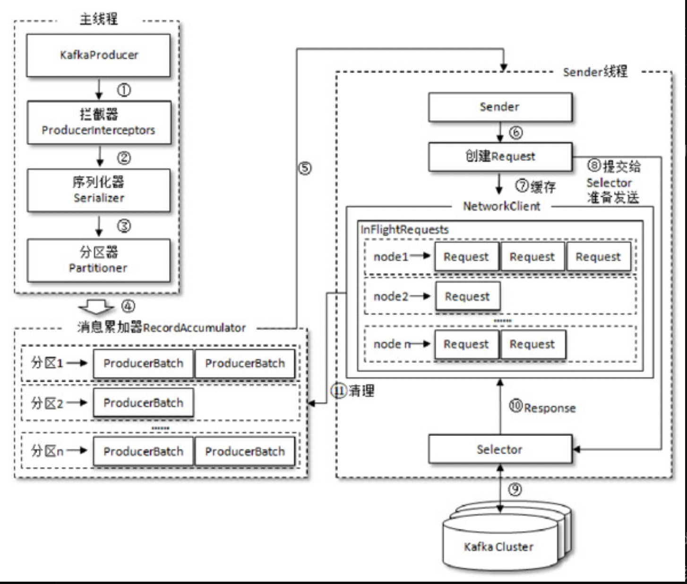

常见消息队列
1. Kafka
2. RocketMQ
3. RabbitMQ
# 通用问题

0. 消息可靠性
1. 重复消费
2. 幂等
3. 有序
4. 消息回溯
5. 消息堆积
6. 数据双写(数据库+队列)
7. 消息持久化

### kafka
#### 场景
跨系统解耦、异步任务
1. event system「策略模式、handler」 跨系统用户数据同步、异步任务：数据报表跟新、通知子系统
削峰
#### 概念
producer 生产者
整体架构

#### 常见问题
2. 消息可靠性
producer、consumer、broker 都有可能丢消息。
- producer： 
什么情况下会丢消息：选择发后既忘模式，不可重试的异常(如消息过大)，且没处理异常。
如果避免丢消息：设置重试次数(可以避免可重试的异常情况的丢失消息)并做好callback的异常处理，ack:all,-1

ack-1, isr队列过半数

5 消息堆积
生产者速度产生速度大于发送到服务器的速度、
- 调大消息累加器的recordAccumulator,缓存空间默认32mb
- 自定义生产者拦截器过滤一部分消息
